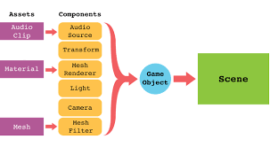
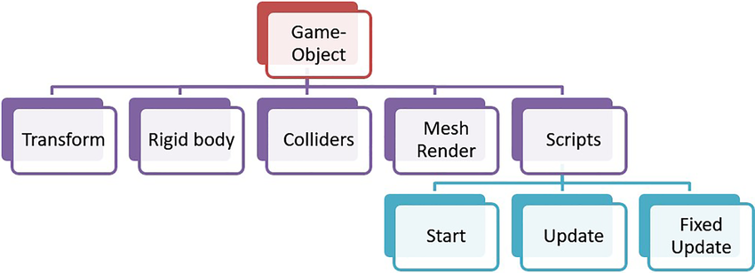
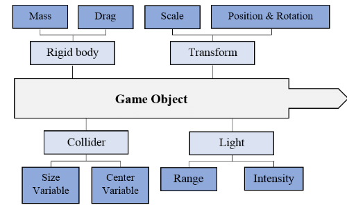

# GameObjects & Components

The fundamental **GameObject–Component** architecture in Unity, with diagrams and examples.

---

## 📌 Overview
Unity uses a **composition-based design**, where:
- **GameObjects** are the basic building blocks of a scene.
- **Components** are the modular behaviors and properties you attach to GameObjects.

Together, they form the foundation of every Unity project.

- **Unity Scene Diagram**:  



---

## 📌 GameObjects
- The **basic container** in Unity.
- Represents anything in your scene: characters, props, cameras, UI, lights.
- Always includes a **Transform Component** (position, rotation, scale).

👉 Think of a **GameObject** as an **empty box** that gains functionality only when you add Components.

- **Unity GameObject Diagram **:  



---

## 📌 Components
- **Behavioral building blocks** that define *what a GameObject does*.
- Examples:
  - `Mesh Renderer` → makes an object visible.
  - `Rigidbody` → enables physics.
  - `Collider` → defines physical boundaries.
  - `Audio Source` → plays sounds.
  - `MonoBehaviour` scripts → add custom logic.

👉 Think of **Components** as **ingredients** you add to your GameObject to make it useful.

- **Unity Components Diagram **:  



---

## ⚙️ How They Work Together
Every GameObject starts with a `Transform`.  
You can then attach multiple Components to build its full behavior:

---
# Unity C# Basics: Classes, Variables, Functions, and Properties  

- **Classes** – The blueprint for objects.  
- **Variables (Fields)** – Store data inside classes.  
- **Functions (Methods)** – Define behavior and logic.  
- **Properties** – A controlled way to expose and manage variables.  

---

# Classes in Unity

In C#, a **class** is like a blueprint that defines objects.  
In Unity, most of the scripts you write inherit from `MonoBehaviour`.

```csharp
using UnityEngine;

public class Player : MonoBehaviour
{
    // Variables (Fields)
    public string playerName = "Hero";
    public int health = 100;

    // Functions (Methods)
    void Start()
    {
        Debug.Log("Player has spawned: " + playerName);
    }

    void Update()
    {
        Debug.Log("Player health: " + health);
    }
}
```
---

# Variables and Data Types

A beginner-friendly guide introducing the core foundations of C# used in Unity game development.

---

## 📌 Variables

Variables are essentially “named boxes” that store data for use elsewhere in your code. Each variable must have:

1. A **type**
2. A **name**
3. A trailing **semicolon** to mark the end of the statement
4. Optionally, an **inline comment** using `//` for clarity 

Naming best practices: Stick to Latin letters and follow C# naming conventions.

**Scope & Visibility**

* public → visible & editable in Unity Inspector

* private → hidden from Inspector (default)

* [SerializeField] private → hidden in code but still editable in Inspector

---

## 📌 Data Types

A **data type** determines:

* What operations you can perform on data
* The interpretation of the data
* How much memory it occupies ([Circuit Stream][1])

Though C# offers over ten data types, only the most commonly used ones are needed for Unity development,

**Pro tip:**

* Use **double quotes** for strings.
* Add an **“f”** suffix for float literals (e.g., `9.99f`).([Circuit Stream][1])

---

## Type Conversion

Sometimes you need to convert between data types, such as:

* Displaying numbers as text

* Using `float` values with UI components expecting `int`

* Parsing user-input strings as numbers ([Circuit Stream][1])

* **Implicit conversion** occurs automatically—only if there's no risk of data loss. Otherwise, it fails.

* **Explicit conversion**, or **casting**, is required for potentially lossy conversions (e.g., converting `float` → `int`). For example:

  ````csharp
  int myInt = (int)myFloat;
  ``` :contentReference[oaicite:8]{index=8}
  ```
  ````

---

# Methods & Functions

Function: A reusable block of code that performs a specific task.

Method: A function that belongs to a class (in Unity, scripts are usually classes).

Example:

```csharp
void SayHello()
{
    Debug.Log("Hello, Unity!");
}
```
## 📌 Unity Lifecycle Methods

Unity calls certain methods automatically depending on what is happening in the game.

🟢 Start()

Called once when the script starts.

```csharp
void Start()
{
    Debug.Log("Game Started!");
}
```

🔁 Update()

Runs once per frame (best for input & non-physics updates).

```csharp
void Update()
{
    if (Input.GetKeyDown(KeyCode.Space))
    {
        Debug.Log("Space key pressed!");
    }
}
```

⚙️ FixedUpdate()

Runs at fixed intervals (best for physics calculations).

```csharp
void FixedUpdate()
{
    rb.AddForce(Vector3.forward * 10);
}
```

🎥 LateUpdate()

Called after Update(). Useful for camera following.

```csharp
void LateUpdate()
{
    transform.position = player.position + offset;
}
```

✅ OnEnable() / ❌ OnDisable()

Triggered when a GameObject becomes active/inactive.

```csharp
void OnEnable()
{
    Debug.Log("Object Enabled");
}
void OnDisable()
{
    Debug.Log("Object Disabled");
}
```

🗑️ OnDestroy()

Called just before an object is destroyed.

```csharp
void OnDestroy()
{
    Debug.Log("Object Destroyed!");
}
```

## 📌 Custom Functions

You can create your own functions to organize logic.

Example:

```csharp
void Jump()
{
    Debug.Log("Jumping!");
}
```

📞 Calling Functions

You can call a function from another function:

```csharp
void Update()
{
    if (Input.GetKeyDown(KeyCode.Space))
    {
        Jump();
    }
}

void Jump()
{
    Debug.Log("Jumping!");
}
```
---

# Properties

Property: A variable inside a class that controls some behavior or state.

In Unity, many components expose properties that you can read or change.

Example:
```csharp
transform.position = new Vector3(0, 5, 0);
```

This sets the GameObject’s position in 3D space.

🔧 Built-in Unity Properties
🧱 Transform

Every GameObject has a Transform component that controls:

📍 Position
```csharp
transform.position = new Vector3(0, 1, 0);
```

🔄 Rotation
```csharp
transform.rotation = Quaternion.Euler(0, 90, 0);
```

📏 Scale
```csharp
transform.localScale = new Vector3(2, 2, 2);
```

📝 Custom Properties

You can create your own properties in C#.
```csharp
public class Player : MonoBehaviour
{
    private int health = 100;

    public int Health
    {
        get { return health; }
        set { health = Mathf.Clamp(value, 0, 100); }
    }
}
```

🎮 Accessing & Modifying GameObjects
🔎 Find GameObjects
```csharp
GameObject enemy = GameObject.Find("Enemy");
```

📦 Get Components
```csharp
Rigidbody rb = GetComponent<Rigidbody>();
```

🎨 Change Properties
```csharp
Renderer rend = GetComponent<Renderer>();
rend.material.color = Color.red;
```

🧩 Practical Examples
Example 1: Moving a Cube
```csharp
public float speed = 5f;

void Update()
{
    transform.position += Vector3.right * speed * Time.deltaTime;
}
```

Example 2: Scaling an Object
```csharp
void Update()
{
    if (Input.GetKeyDown(KeyCode.UpArrow))
    {
        transform.localScale *= 1.2f; // grow
    }
    if (Input.GetKeyDown(KeyCode.DownArrow))
    {
        transform.localScale *= 0.8f; // shrink
    }
}
```

Example 3: Changing Color
```csharp
void Update()
{
    if (Input.GetKeyDown(KeyCode.C))
    {
        GetComponent<Renderer>().material.color = Color.green;
    }
}
```

---

# 📌 Arithmetic Operators & Order of Operations

You can use standard arithmetic operators (e.g., `+`, `-`, `*`, `/`) on numeric variables. C# follows familiar math precedence rules—multiplication and division are evaluated before addition and subtraction.

---

## Example: Integer vs Float Division

```csharp
int result1 = 5 / 2;        // result1 == 2
float result2 = 5.0f / 2;   // result2 == 2.5f
float result3 = 5 / 2.0f;   // result3 == 2f (because 5/2 is int division first)
```

Explanation:

* **Line 1**: Both operands are `int`, so result is truncated to `2`.
* **Line 2**: Using a float operand yields a `float` result of `2.5f`.
* **Line 3**: Although one operand is `float`, the division is still performed as integer division first, resulting in `2f`—this demonstrates that data type influences evaluation order.([Circuit Stream][1])

**Key takeaway:** Pay careful attention to data types during operations. C# promotes to the “largest” type for calculations.

---

Here’s a polished and expanded **GitHub-style README** based on the Awesome Tuts blog post **“C# Programming With Unity – Conditional Statements”**. The content is beginner-friendly and designed to function as a standalone tutorial, ideal for a Unity learning repository.

---

# 📌 Conditional Logic (`if`, `else`, `else if`)

Conditional statements allow your code to execute specific blocks based on whether a condition evaluates to **true** or **false**. They're essential for branching logic, handling events, and making your game interactive.

---

## Anatomy of an `if` Statement

The basic structure in C# and Unity is straightforward:

```csharp
if (CONDITION)
{
    // Execute this code block when CONDITION == true
}
```

* `CONDITION` must be a boolean expression (`true` or `false`).
* If the condition holds true, the enclosed block runs; otherwise, it's skipped. ([Anyone Can Learn To Make Games][1])

### Example:

```csharp
if (2 > 1)
{
    Debug.Log("This will always run!");
}
```

Here, `2 > 1` always evaluates to true, so the log fires every time. 

Or, using variables:

```csharp
float a = 3f;
float b = 4f;

if (a > b)
{
    Debug.Log("a is greater than b");
}
```

Since `3f` is not greater than `4f`, this block won't execute. 

---

## 📌 Comparison Operators You Can Use

Comparison operators enable nuanced checks:

* `<`  — Less than
* `>`  — Greater than
* `<=` — Less than or equal to
* `>=` — Greater than or equal to
* `==` — Equal to
* `!=` — Not equal to ([Anyone Can Learn To Make Games][2], [W3Schools][3])

These are invaluable for comparing scores, positions, health values, etc.

---

## `if` … `else` Structures

Often, you want a fallback when the `if` condition fails. The `else` clause handles that:

```csharp
if (playerHealth <= 0)
{
    // Handle player's death
}
else
{
    // Continue the game
}
```

This ensures your code responds appropriately whether the player is alive or not. 

To manage multiple scenarios, you can chain conditions using `else if`:

```csharp
if (health >= 75)
{
    Debug.Log("You're in great shape!");
}
else if (health >= 25)
{
    Debug.Log("You're hurt, be careful!");
}
else
{
    Debug.Log("You’re near defeat!");
}
```

This creates a clear decision flow for varying health levels.

---

## 🚀 Practical Unity Examples

Here are practical uses of conditional statements in Unity contexts:

* Checking enemy status:

  ```csharp
  if (!enemy.isAlive)
  {
      Destroy(enemy.gameObject);
  }
  ```

* Verifying player input:

  ```csharp
  if (Input.GetKeyDown(KeyCode.Space))
  {
      Jump();
  }
  ```

* Managing inventory capacity:

  ```csharp
  if (inventorySlots >= maxSlots)
  {
      ShowInventoryFullWarning();
  }
  ```

These examples reflect typical Unity game logic scenarios.

---

## Advanced Flow Control

Unity and C# offer additional tools:

* **`switch` statements** — Efficiently handle many discrete values:

  ```csharp
  switch (playerState)
  {
      case PlayerState.Idle:
          Idle();
          break;
      case PlayerState.Running:
          Run();
          break;
      default:
          Jump();
          break;
  }
  ```

* **Ternary operator** (`?:`) — Compact conditionals:

  ```csharp
  string status = (health > 0) ? "Alive" : "Dead";
  ```

* **Short-circuit logic** (`&&`, `||`) — Safe state checks:

  ```csharp
  if (player != null && player.isReady)
  {
      player.StartGame();
  }
  ```

These constructs are powerful companions once you’ve mastered the basics.

---

## Best Practices & Tips

* Keep boolean conditions **clear and concise** for readability.

* Favor **`else if` over nested `if` statements** to reduce complexity.

* Employ **early returns** for cleaner flows:

  ```csharp
  if (health <= 0)
  {
      HandleDeath();
      return;
  }
  // Continue healthy logic
  ```

* Use **comments** to clarify conditional logic intent when needed.

---

# 🚀 C# - Beginner Unity Scripting
Learn the C# scripting logic basics that power Unity. These videos covers conditionals, loops, arrays, methods, and events with Unity examples so you can understand how logic flows inside a C# script.
https://www.youtube.com/playlist?list=PLX2vGYjWbI0S9-X2Q021GUtolTqbUBB9B

---

## 🚀 Roll-a-Ball Game! Beginner learning project
Welcome to 3D Beginner: Roll-a-Ball Game! In this learning project, you’ll:
* Use Unity Editor and its built-in capabilities to set up a simple game environment
* Write your own custom scripts to create the game functionality
* Create a basic user interface to improve the game experience
* Build your game, so other people can play it!
** Roll-a-Ball Tutorial ** 
https://learn.unity.com/course/roll-a-ball?version=6.0


---

# UI Canvas
## 🖼️ The Canvas
- The **foundation** of every Unity UI.
- All UI elements **must** be children of a Canvas.
- Handles:
  - Rendering order of UI elements.
  - Scaling for different screen resolutions.
  - Event system interaction.

**Canvas Render Modes**:
1. **Screen Space - Overlay** → UI is drawn directly on screen (most common for HUDs).
2. **Screen Space - Camera** → UI is rendered relative to a camera.
3. **World Space** → UI behaves like a 3D object in the scene.


---

## 🧩 UI Components

### 1. **Text / TextMeshPro**
- Displays text on screen.
- **TextMeshPro** is the modern, flexible alternative with better styling and performance.

### 2. **Image**
- Displays 2D sprites or textures.
- Used for icons, backgrounds, and decorative UI.

### 3. **Raw Image**
- Displays unscaled textures (e.g., video, render textures).

### 4. **Button**
- Clickable element that triggers actions via the `OnClick()` event.

### 5. **Toggle**
- Checkbox-like UI that switches between **on/off** states.

### 6. **Slider**
- Draggable bar to represent a numeric value within a range (e.g., volume).

### 7. **Scrollbar**
- Scrollable control for lists or large panels.

### 8. **Dropdown**
- Expanding list to select one option from many.

### 9. **Input Field**
- Allows user text entry.
- Often paired with scripts for chat boxes, usernames, or form input.

### 10. **Panel**
- A rectangular container (usually semi-transparent).
- Used to group UI elements visually.

### 11. **Mask / Rect Mask 2D**
- Restricts visibility of child elements to a defined shape.
- Useful for scroll views and minimaps.

### 12. **Scroll View**
- A ready-made component combining:
  - **Viewport** (mask)
  - **Content** (elements)
  - **Scrollbars**
- Enables scrolling through long lists or panels.

### 13. **Event System**
- Automatically created with a Canvas.
- Handles user input (mouse, touch, keyboard, gamepad).

---

## 🎨 Layout Components
Unity provides special components to help organize UI:

- **RectTransform** → replaces Transform for UI elements (anchors, pivot, stretch).
- **CanvasScaler** → scales UI for different screen resolutions.
- **Layout Group Components**:
  - Horizontal Layout Group
  - Vertical Layout Group
  - Grid Layout Group
- **Content Size Fitter** → adjusts element size automatically based on content.

---

## 💡 Best Practices
- Use **TextMeshPro** instead of legacy Text.
- Organize UI using **Panels** and **Layout Groups** for flexibility.
- Minimize number of **Canvases**—too many can hurt performance.
- Use **Anchors** to make UI responsive to different screen sizes.

---

## 🚀 Getting Started
1. Create a new Canvas (`GameObject > UI > Canvas`).
2. Add a **Panel** to serve as background.
3. Add UI elements: Text, Buttons, Sliders, etc.
4. Attach scripts to UI elements to handle interaction.

---

## 📚 Resources
- 📖 [Unity Manual – UI Overview](https://docs.unity3d.com/Manual/UISystem.html)  
- 📖 [Unity Manual – Canvas](https://docs.unity3d.com/Manual/UICanvas.html)  
- 📖 [Unity Manual – UI Components](https://docs.unity3d.com/Manual/script-UI.html) 

### **UI Components Video Tutorial **
- https://learn.unity.com/tutorial/ui-components

---

## 📌 Assignment Week #2 - Flappy Bird Game
 https://www.youtube.com/watch?v=XtQMytORBmM


